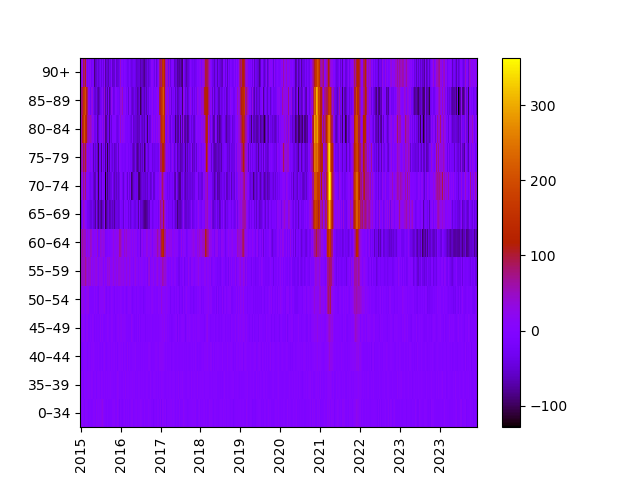

# Tracking changes in death rate in Hungary

Was inspired by the COVID-19 pandemic, and data can be downloaded from the Central Statistics Bureau [KSH](https://www.ksh.hu/stadat_files/nep/hu/nep0065.html) in CSV format. Once downloaded, make a 
conda environment using the provided yaml file, and reformat the downloaded CSV like:

```
conda env create -f environment.yml
awk -f massage.awk stadat-nep0065-22.2.1.2-hu.csv > massaged.csv
conda activate kshdeath
python main.py -c massaged.csv
```

You are getting a simple heatmap, the higher the death rate, the more yellow the tiles are. This image is saved as `image.png` <br>

